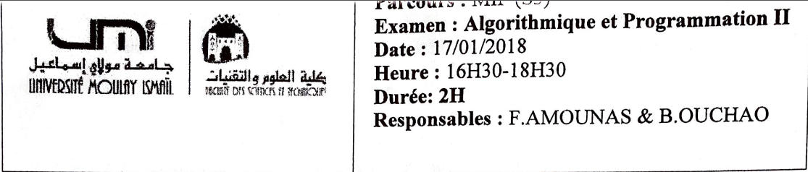

### Exercice 1
#### A) 1) Principe de copie coller 
De tableau vers tableau
```c
char* delete(char ch[], char s){
	char *resultat = (char*)malloc(strlen(ch)*sizeof(char));
	int i, k = 0;
	for (i = 0; ch[i] != '\0' ; ++i)
	{
		if( ch[i] != s) {
			resultat[k] = ch[i];
			k++;
		}
	}
	resultat[k] = '\0';
return resultat;
}
```
#### A) 2)
```c
char* start(char ch[], int n){
	char *resultat = (char*)malloc((n+1)*sizeof(char));
	int i;
	for (i = 0; (i < n && ch[i] != '\0') ; ++i)
	{
		resultat[i] = ch[i];
	}
	resultat[i] = '\0'; // resultat[n] = '\0';
return resultat;
}

char* end(char ch[], int n){
	char *resultat = (char*)malloc((n+1)*sizeof(char));
	int i, tailleCh;
	tailleCh = strlen(ch);

	for (i = 0 ; i < n  ; i++)
	{
		*(resultat +  i) = ch[tailleCh - n + i ];
	}
	resultat[n] = '\0';
return resultat;
}

// autre methode pour end
char* endBis(char ch[], int n){
	char *resultat = (char*)malloc((n+1)*sizeof(char));
	int i, tailleCh;
	tailleCh = strlen(ch);
	int j = tailleCh-1;
	for (i = n-1 ; i >= 0 && j >= 0  ; i--)
	{
		*(resultat +  i) = ch[j];
		j--;
	}
	resultat[n] = '\0';
return resultat;
}
```
#### A) 3)
```c
char* middle(char ch[], int p, int q){
	char *resultat = (char*)malloc((q-p+1)*sizeof(char));
	int i,j;
	for (j = 0, i = p; i <= q ; i++,  j++)
	{
		resultat[j] = ch[i];
	}
	resultat[j] = '\0';
return resultat;
}
```
#### B) 
```c
void triSelection(int t[], int n){
	int  i, j, tmp, p;
	for(i=0;i<n;i++){
		p = i;
		for(j=i;j<n;j++)
			if(t[j] < t[p] ){
				p = j;
			}
		tmp = t[p];
		t[p] = t[i];
		t[i] = tmp;
	}
}

void matriceSpiralee(int v[], int n, int **m){
    
  triSelection(v, n);

	int dl, fl, j = 0, i;
	int dc, fc;
	dl = 0; dc = 0;
	fl = n-1; fc = n-1;
	while(dl <= fl && dc <= fc){
           // 1
			for (i = dc; i <= fc; ++i)
				{
					m[dl][i] = v[j];
					j++;
				}
			dl++;
			for (i = dl; i <= fl; ++i)
				{
					m[i][fc] = v[j];
					j++;
				}
			fc--;
			if(dl <= fl){
				for (i = fc; i >= dc; i--)
			    	{
			    		 m[fl][i] = v[j];
			    		 j++;
			    	}
			    fl--;
			}
			if(dc <= fc){
				for (i = fl; i >= dl; i--)
			    	{
			    		m[i][dc] = v[j];
			    		j++;
			    	}
			    dc++;
			}
	}
}

```
### Exercice 2
#### a) 
```c
#define H 15 // hauteur en pixel
#define L 10 // largeur en pixel

unsigned char** allouerImage(){
	unsigned char **image;
	image = (unsigned char**)malloc(H*sizeof(unsigned char *));
	int i;
	for (i = 0; i < H; ++i)
	{
		image[i] = (unsigned char*)malloc(L*sizeof(unsigned char));
	}
return image;
}
```

#### b) 
```c
int* histoImage(unsigned char **im){
	int *t = (int*)calloc(256,sizeof(int)); // initialser par de zeros, 0 0 0 
	int i, j, k;
	for (i = 0; i < H; ++i)
	{
		for (j = 0; j < L; ++j)
		{
			k = im[i][j];
			t[k]++;
		}
	}
return t;
}
```

#### c) 
```c
// On decompose le probleme 😎

unsigned char E(unsigned char **im, int x, int y){
	/* cette fonction return le min */
	unsigned char res;
	// chercher le min
		res = min(im[x-1][y-1], min(im[x-1][y], im[x-1][y+1]));
		res = min(res, min(im[x][y-1], im[x][y+1]));
		res = min(res, im[x+1][y]);
		res = min(res, min(im[x+1][y-1], im[x+1][y+1]));
		return res;
}

unsigned char** erodeImage(unsigned char **im){
	unsigned char **image;
	image = (unsigned char**)malloc(H*sizeof(unsigned char *));
	int i, j;
	for (i = 0; i < H; ++i)
	{
		image[i] = (unsigned char*)malloc(L*sizeof(unsigned char));
	}
  // ne prend pas les bords en compte
	for(i = 1; i < H-1; ++i)
	{
		for (j = 1; j < L-1; ++j)
		{
			image[i][j] = E(im, i, j);
		}
	}
return image;
}
```

#### d) 
```c
int distance(unsigned char **im, int x, int y, int u, int v, int n){
	int dist = 0, i, j;
	// on passe vers les patchs
	int xn = x-n, yn = x+n;
	int un = u-n, vn = u+n;
	int k = L*H; // le nombre de pixel
	for(i = -1; i <= 1 ; ++i)
	{
		for (j = -1; j <= 1; ++j)
		{
			dist += pow((im[xn+i][yn+j] - im[un+i][vn+j]), 2);
		}
	}
	dist *= k;
	dist = sqrt(dist);
	if(dist) dist = 1/dist;
return dist;
}
```
### Exercice 3
#### 1)
```c
#define MAX 100 // MAX c'est N
char dictio[MAX][20];
```
#### 2)
```c
// Si on passe le dictionnaire en parametres on definit 
// ce type seulement:
// motCode* compresser(char text[], char dictio[][20]);

typedef struct{
	int indice;
	char c;
}motCode;

// Sinon on definit ces types et en 
// definit le  prototype comme suite 
// (et adapter le corps de la fonction)
//  Resultat* compresser(char text[]);
/*
typedef struct{
	int indice;
	char c;
}motCode;

typedef struct{
	motCode code;
	char dictio[MAX][20];
}Resultat;
*/

// Ensuit en decompose le probleme ;)

int exist(char dictio[][20], char ch[]){
  /* cette fonction verifier si le mot ch
     existe dans le dictionnaire.
  */
	int i;
	for (i = 0; i < MAX; ++i)
	{
		if(strcmp(dictio[i], ch) == 0)
			return i;
	}
return 0;
}

void ajouterChar(char motLu[], char c){
    /*
    Cette fonction ajoute un caracter a  la fin 
    d'une chaine de caracteres motLu.
    */
    char temp[2] = {'v','\0'};
    temp[0] = c;
    strcat(motLu, temp);
}

motCode* alloueCode(){
    /*
    Cette fonction alloue l'espace memoire 
    necessaire pour stocker le  type motCode.
    */
    motCode *code = (motCode*)malloc(30*sizeof(motCode));
    /// indice -1 par defaut
    int i;
    for(i=0; i<30; i++) code[i].indice = -1;
return code;
}

void ajouterAuCode(motCode code[], i, indice, c){
    /*
    Cette fonction ajoute un code (indice, c)
     a la fin  de tableau code (position i)
    */
    code[i].indice = indice;
    code[i].c = c;
}

//int tailleCode = 0; 
motCode* compresser(char text[], char dictio[][20]){
    motCode *code = alloueCode();
    //tailleCode = 0;
	strcpy(dictio[0], ""); // Par convention
	char motLu[20];
	int textIt = 0, indice, i = 1, codeIt = 0, dernierIndice = 0, dernierChar;
	dernierChar = text[textIt];
	/// 1) Parcourir le text
	int sz = strlen(text);
	for (textIt = 0; textIt < sz; ++textIt)
	{
	    /// construire le mot à ajouté!
		motLu[0] = text[textIt]; motLu[1] = '\0';
		/// Repeter tant que le motLu existe
		do{
            /// verifier si motLu est dans dictio
		   indice = exist(dictio, motLu);
		   if(indice != 0){ /// s'il existe
		    	textIt++;///avancer vers le caractère suivant
		    	/// ajouter le
		    	if(textIt < sz){
                        ajouterChar(motLu, text[textIt]);
		    	        dernierIndice = indice;
                        dernierChar = text[textIt];
		    	}
		    }
		    else{ /// sinon
                /// ajouter au dictionnaire
		    	strcpy(dictio[i], motLu);
		    	i++;
		    	/// stocker le code
		    	if(strlen(motLu) == 1)
                    ajouterAuCode(code, codeIt, 0, text[textIt]);
		    	else
		    	    ajouterAuCode(code,codeIt,
                         dernierIndice, dernierChar);

		    	motLu[0]='\0'; /// vider le motLu
		    	codeIt++;
		    }
		}while(indice != 0);
	}
	//tailleCode = codeIt;
	return code;
}
```

#### 3)
```c
void decompresser(motCode code[], char dictio[][20]){
	int i=0;
	while(code[i].indice != -1) // while(i < tailleCode)
	{
		int ind = code[i].indice;
		printf("%s", dictio[ind]);
		putchar(code[i].c);
		i++;
	}
}

```
