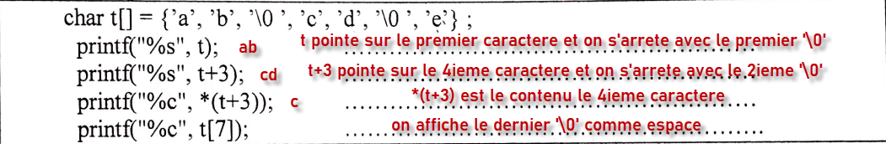
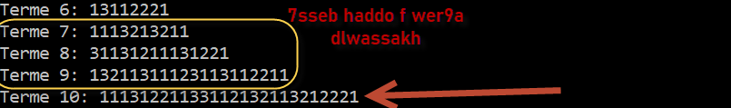

#### Exercice 1
##### A) Les baese  de pointeurs: 
  a) Affiche 20   et b) erreur *ptr car ptr n'est pas initialisé
##### B) 

#### Exercice 2 *Sudoku*
##### 1)
```c
int tab[81]; // statique
int *tab=(int*)malloc(81*sizeof(int)); // dynamique
```
##### 2)
```c
int IndCell(int y, int x){
    int indice;
    indice = (y*9) + x;
    return indice;
}
```
##### 3)
```c
// on decompose en 2 fonctions 😎
int compterOccurrences(int tab[], int y, int n){
    int cpt = 0, i;
    for(i = 0; i < 9; i++){
        int ind = IndCell(y, i);
        if(tab[ind] == n){ /// trouvé
            cpt++;
        }
    }
    return cpt;
}

int DoublonLigne(int tab[], int y){
    int i, premier = -1, ind, cpt, n;
    /// pour chaque valeur n de la ligne y
    for(i = 0; i<9; i++){
        ind = IndCell(y, i);
        n = tab[ind];
        /// compter les occurrences de n
        /// Si la case est non vide
        if(n != 0){
            cpt = compterOccurrences(tab, y, n);
            /// s'il existe en doublon
            if(cpt >= 2){
                /// sauvegarder le premier
                if(premier == -1) premier = n;
            }
        }
    }
    /// si il y a de doublons retourner le premier
    if(premier != -1) return premier;
    /// sinon retourner 0
    return 0;
}

// Autre methode
int DoublonLigneBis(int tab[], int y){
    int i, cpt, n;
    /// pour chaque valeur n de la ligne y
    for(i = 0; i<9; i++){
        n = tab[IndCell(y, i)];
        /// compter les occurrences de n
        /// Si la case est non vide
        if(n != 0){
            cpt = compterOccurrences(tab, y, n);
            /// s'il existe en doublon
            if(cpt >= 2)
                return n;
        }
    }
    /// sinon retourner 0
    return 0;
}
```
##### 4)
```c
int VerifLigne(int tab[], int y){
    int *existe = (int*)calloc(10, sizeof(int)); // contient des zeros  0 0 0 ...
    int j, cpt = 0;
        for(j = 0; j < 9; j++){
            /// trouver l'indice équivalent
            int ind = IndCell(y, j);
            /// récupérer la valeur
            int valeur = tab[ind];
            if(valeur != 0 && existe[valeur] == 0 ){
                /// incrémenté le nombre des valeurs unique
                cpt++;
                /// marqué comme vu!
                existe[valeur] = 1;
            }
        }

    return (cpt == 9); /// vrai 1, faux 0
}

// Autre methode
int VerifLigneBis(int tab[], int y){
    int *existe = (int*)calloc(10, sizeof(int)); // contient des zeros  0 0 0 ...
    int j;
        for(j = 0; j < 9; j++){
            /// récupérer la valeur
            int valeur = tab[IndCell(y, j)];
            if(valeur == 0 || existe[valeur] == 1 ){
                return 0;
            }else{
                /// marqué comme vu!
                existe[valeur] = 1;
            }
        }
    return 1;
}


// Autre methode  utilisant DoublonLigne()
int VerifLigneBis2(int tab[], int y){
    int j;
    /// verifier s'il ya de doublon
    if(DoublonLigne(tab, y) != 0)
        return 0;
    /// verifier s'il n'y a pas de case vide
    for(j = 0; j < 9; j++){
        int valeur = tab[IndCell(y, j)];
        if(valeur == 0)
            return 0;
    }

    return 1;
}

```
##### 5)
```c

int DoublonCarre(int tab[], int y, int x){
    int *existe = (int*)calloc(10, sizeof(int)); // contient des zeros  0 0 0 ...
    int i,j, cpt = 0;
    for(i = 0; i < 3; i++) /// ajustement
        for(j = 0; j < 3; j++){ ///ajustement
            /// trouver l'indice équivalent
            int ind = IndCell(y+i, x+j);
            /// récupérer la valeur
            int valeur = tab[ind];
            if(valeur != 0 &&existe[valeur] == 0){
                /// incrémenté le nombre des valeurs unique
                cpt++;
                /// marqué comme vu!
                existe[valeur] = 1;
            }
        }
    return (cpt == 9);
}

// Autre methode
int DoublonCarreBis(int tab[], int y, int x){
    int *existe = (int*)calloc(10, sizeof(int)); // contient des zeros  0 0 0 ...
    int i,j;
    for(i = 0; i < 3; i++) /// ajustement
        for(j = 0; j < 3; j++){ ///ajustement
            /// trouver l'indice équivalent
            int ind = IndCell(y+i, x+j);
            /// récupérer la valeur
            int valeur = tab[ind];
            if(valeur != 0 && existe[valeur] == 0){
                /// marqué comme vu!
                existe[valeur] = 1;
            }else{
                return 0;
            }
        }
    return 1;
}

```
##### 6)
```c
// On definit des fonctions structures auxiliaires  😎

struct ind{
    int y;
    int x;
};
// Type Indice
typedef struct ind Indice;

Indice quelCarre(y, x){ /// ESSAYER DE SIMPLIFIER :) hadi fiha bzzaf d storra
    Indice res;
    /// CARRE 1
    if((y >= 0 && y<= 2) && (x >= 0 && x <= 2)){
        res.y = 0; // ligne
        res.x = 0; // colonne
    }
    /// CARRE 2
    if((y >= 0 && y<= 2) && (x >= 3 && x <= 5)){
        res.y = 0; // ligne
        res.x = 3; // colonne
    }
    /// CARRE 3
    if((y >= 0 && y<= 2) && (x >= 6 && x <= 8)){
        res.y = 0; // ligne
        res.x = 6; // colonne
    }
    /// CARRE 4
    if((y >= 3 && y<= 5) && (x >= 0 && x <= 2)){
        res.y = 3; // ligne
        res.x = 0; // colonne
    }
    /// CARRE 5
    if((y >= 3 && y<= 5) && (x >= 3 && x <= 5)){
        res.y = 3; // ligne
        res.x = 3; // colonne
    }
    /// CARRE 6
    if((y >= 3 && y<= 5) && (x >= 6 && x <= 8)){
        res.y = 3; // ligne
        res.x = 6; // colonne
    }
    /// CARRE 7
    if((y >= 6 && y<= 8) && (x >= 0 && x <= 2)){
        res.y = 6; // ligne
        res.x = 0; // colonne
    }
    /// CARRE 8
    if((y >= 6 && y<= 8) && (x >= 3&& x <= 5)){
        res.y = 6; // ligne
        res.x = 3; // colonne
    }
    /// CARRE 9
    if((y >= 6 && y<= 8) && (x >= 6&& x <= 8)){
        res.y = 6; // ligne
        res.x = 6; // colonne
    }
return res;
}

/// Essayer de decomposer cette fonction 
/// en plusieur fonctions pour simplifier 
/// pour la lisibilité de code (😎t9dro tkhrjo mnha 2 fonctions auxiliaires khrin)
void Candidat(int tab[], int y, int x){
    /// determiner  quel carre
    Indice cord = quelCarre(y, x);
    /// determiner  quel case
    int k = IndCell(y, x);
    /// verifier si le case est vide
    if(tab[k] != 0) /// non vide
        printf("La case est deja pleine: %d", tab[k]);
    else{ 
         // Remarque 😎: Hnaya t9edro tkhrjo deux fonctions
        /// chercher les valeurs possible pour la ligne
        int possible[9], taille = 0, i;
        /// pour chaque valeur 1, 2,...,9
        /// Tester s'il ne crée pas de doublon
        for(i = 1; i <= 9; i++){
            tab[k] = i; /// insérer la valeur
            if(DoublonLigne(tab, y) == 0){
                /// pas de doublon, possible!
                possible[taille] = i;
                taille++;
            }
        }
        tab[k] = 0; /// remettre la case au vide!

        /// afficher ceux possibles ainsi pour le carree
        /// On peut faire dans une deuxieme fonction auxiliaire
        for(i = 0; i < taille; i++){
            /// vérifier si possible[i] ne
            /// crée pas de doublon sur le carre
            /// sous-matrice 3x3
            int dy, dx, existe = 0;
            for(dy = 0; dy < 3; dy++){
                for(dx = 0; dx < 3; dx++){
                    int k = IndCell(cord.y+dy, cord.x+dx);
                    int v = tab[k];
                    if(v == possible[i])
                        existe = 1;
                }
            }

            if(existe == 0) /// pas de doublon
                printf("%d est possible\n", possible[i]);
        }
    }
}
```
#### Exercice 3 *Suite de Conway*
##### 1)


##### 2)
```c
#define MAX_CHIFFRE 100
struct terme{
    int taille;
    int rep[MAX_CHIFFRE];
};

typedef struct terme Terme;
```

##### 3)
```c
// On decompose le probleme  😎
int comptperOccConsicutive(Terme *in, int i){
    int cpt = 0;
    int j = i;
    while(in->rep[i] == in->rep[j]){
        cpt++;
        j++;
    }
return cpt;
}

Terme* compute(Terme *in){
    Terme *out = (Terme*)malloc(sizeof(Terme));
    int i, j = 0, occ;
    for(i = 0; i < in->taille; i = i + occ){
        occ = comptperOccConsicutive(in, i);
        out->rep[j] = occ;
        j++;
        out->rep[j] = in->rep[i];
        j++;
    }
    out->taille = j;
    return out;
}


```

##### 4)
```c

void print(int n){
    printf("Voici les n premiers termes de la suite de Conway.\n");
    printf("Terme 0: 1\n");

    Terme x0, *precedent, *suivant;
    x0.taille = 1;
    x0.rep[0] = 1;
    precedent = &x0;
    
    int i;
    for(i = 1; i <= n; i++){
        suivant = compute(precedent);
        printf("Terme %d: ", i);
        int j;
        for(j = 0; j < suivant->taille; j++)
            printf("%d", suivant->rep[j]);
        printf("\n");
        precedent = suivant;
    }
    
}

// Partie 2 de la question
#include <stdio.h>
#include <stdlib.h>
void print(int n);
int main()
{
    print(12);
    return 0;
}

```
##### 5)
```c
Terme* reverse(Terme *in){
    Terme *out = (Terme*)malloc(sizeof(Terme));
    int i, j = 0, occ, k=0;
    for(i = 0; i < in->taille; i++){
        occ = in->rep[i];
        i++;
        for(j = 0; j < occ; j++){
            out->rep[k] = in->rep[i];
            k++;
        }
    }
    out->taille = k;
return out;
}
```
